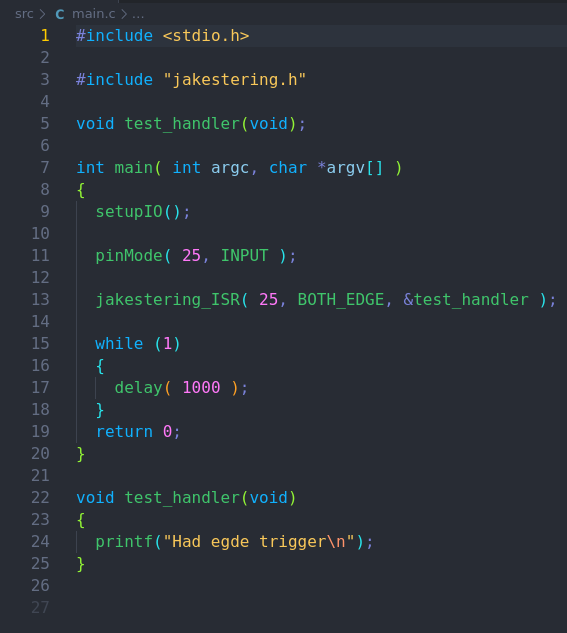
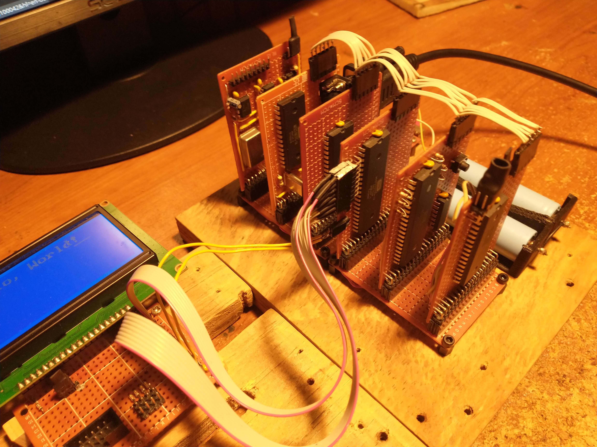

# Embedded Software Portfolio

This is brief overview of some embedded hardware/software projects I have developed over the past few years. The purpose of this site
is to showcase my technical skills as both a competent programmer and engineer.

---

## [JakesteringPi](https://github.com/McCoy1701/JakesteringPi)

This is a C library I wrote to control the I/O pins of a Raspberry Pi Zero through its BCM2835 system-on-chip (SoC), enabling direct register access.
I created this library because I found using MicroPython unsatisfactory, and wanted  full control over the hardware. While searching for alternative,
I discovered the WiringPi library by Gordon Henderson, but it had been deprecated by the time I found it. So, I took the initiative to create my own
alternative. I spent the following month (November of 2023) writing the library from scratch.

My main goal was to make the library as simple as possible, with functionality similar to Arduino code. 



---

## [EEPROM Programmer](https://github.com/McCoy1701/Flash-Programmer)

I developed software to program the SST39SF040 flash ROM using my library, `JakesteringPi`. It's more than just a simple programmer; It allows me to
read to contents of the ROM, retrieve the device ID, write a raw binary file, erase the ROM, compare its contents against a raw binary file.
While it should work for the entire family of SST39SF flash ROMs, I've only tested it with the SST39SF040. Expanding the code to support any 
5v EEPROM would be trivial.

---

## [Logic Analyzer](https://github.com/McCoy1701/LogAnal)

I initially developed this to help debug problems on my 65c02 Workbench computer, but it has become an invaluable tool. It also utilizes my
library, `JakesteringPi`. The software continuously monitors the GPIO lines of a Raspberry Pi Zero waiting for a interrupt. When triggered, it
outputs the state of all the GPIO pins.

---

## [65c02 Workbench Computer](https://github.com/McCoy1701/Project8)



The main goal of this project is to meet my needs for programming EEPROMs, controlling external peripherals via SPI, I2C, and UART, controlling
servos using PWM. Driving other miscellaneous logic devices.

The CPU is a WDC 65c02 running at 1 MHz. It includes an AS6C62256 32k x 8-bit static RAM, though the system uses only 16k for the main RAM. 
There is one 65c22 Versatile Interface Adapters (VIA), which features two 8-bit ports for general-purpose input/output. The 65c22 also enables 
the system to have timer-driven interrupts, based on its own clock running at 1.8432 MHz. The computer has a 512k x 8-bit SST39SF040 flash ROM,
with only 32k in use. This holds all the code for the BIOS, memory monitor, mini assembler/disassembler, and routines for interfacing with a 
128x64 LCD. For communication, the system uses a 65c51 Asynchronous Communications Interface Adapter (ACIA), providing serial 
communication over RS232 with the help MAX232 line driver.

One of the main factors considered during the initial development of the computer was cost. I wanted this machine to be as cheap as
possible while using quality ICs. The entire build only cost me $82. Another key factor was to use components that I already had on hand, or
could scavenge from e-waste. For instance, most of the wiring is from an old IDE cable. When that ran out, I switched to using enamel copper
wire from shaded pole induction motor. The power supply uses a LM7805 from an old typewriter (interestingly, this typewriter had an M50747, which
is a microcomputer on a chip with a CPU derived the 6502).

### Memory Map

| RAM | $0000 - $4000 |
| ACIA | $5000 - $5004 |
| VIA | $6000 - $600F |
| ROM | $8000 - $FFFF |

### Software for the Workbench Computer

One of the first programs I developed for the system was a memory monitor. I took inspiration from WozMon and the monitor on the Apple II line of
computers. I'd like to think my monitor is somewhat more sophisticated than WozMon. It allows for setting the current address to read from, starting
execution at current address, writing *n* bytes to memory, reading *n* bytes back from memory, block-examining memory, showing the current address,
examining and storing addresses (used internally), displaying the contents of the registers, and filling a range of memory with a value.

#### Memory Monitor Commands

| Change Address | `a $xxxx` |
| Write n bytes | `w $xx $xx...` |
| Read n bytes | `r $xxxx` |
| Execute | `x` |
| Block examine | `b $xxxx $xxxx` |
| Show Address | `o` |
| Show Registers | `R` |
| Fill range with value | `f $xxxx $xxxx $xx` |
| Open mini assembler | `m` |
| Open disassembler | `l` |

Writing programs with the memory monitor in machine language quickly became tedious, so I developed a mini assembler. It's started from the memory 
monitor at the current address, allowing you to immediately begin writing assemble code.

```
;Here's a simple program to print out all the ASCII characters.

$0400: lda #$20
$0402: jsr $804d  ;This is the location of the CHAR_OUT routine
$0405: tax
$0406: inx
$0407: txa
$0408: jmp $0402
```

To help facilitate writing programs with the mini assembler I wrote a disassembler. It's started from the memory monitor as well. Once started it
converts the opcode at the current address into assembly language. *side note: when the computer is first power on it does a RAM test and this leaves
all of RAM as $00* The disassembler takes advantage of this when it encounters 4 $00 in a row it stops disassembling.

### Future Software

- Memory allocator
- Forth system

